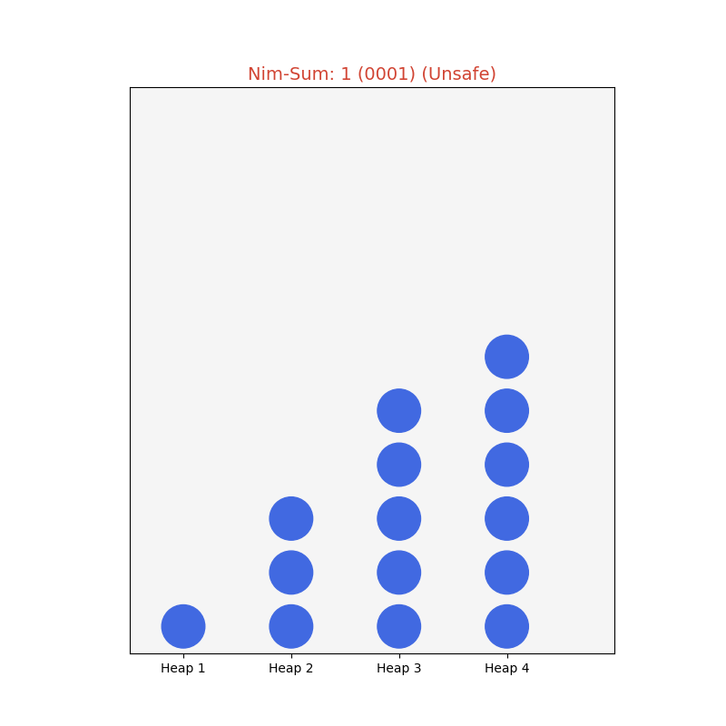
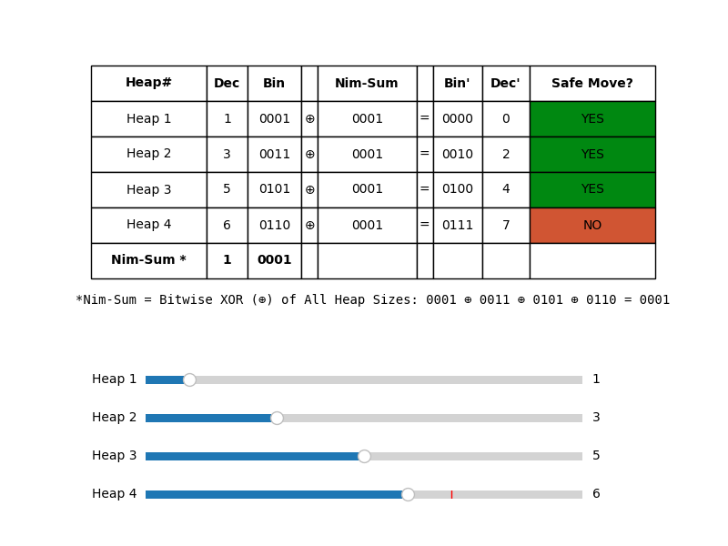

# The Game of Nim: A Tutorial

The Game of Nim is a mathematical strategy game where two players take turns removing objects from heaps or piles. The goal is to be the player who takes the last object. Although it may appear complex at first, Nim has a simple yet beautiful winning strategy based on binary arithmetic and the concept of the "Nim-sum."

## How to Play

1. **Setup:** The game starts with several heaps, each containing a specific number of objects (e.g., sticks, stones, coins). You can adjust the number of objects in each heap using the sliders in our interactive visualization. The default setup includes four heaps.

2. **Turns:** Players alternate turns. On each turn, a player *must* select a heap and remove at least one object from it. A player can remove any number of objects from the chosen heap, up to the entire heap.

3. **Winning:** The player who takes the last object wins the game.

---

## The Secret: Binary XOR and the Nim-sum

The key to winning Nim lies in understanding the Nim-sum, calculated using the bitwise XOR operation (`^` or "XOR").

1. **Binary Representation:** Convert the number of objects in each heap to binary. For example, 5 in decimal is `101` in binary. The code uses a 4-bit binary representation, so 5 becomes `0101`.

2. **Bitwise XOR:** The XOR operation compares the bits in the binary representations of heap sizes. If the bits are the same (0 and 0 or 1 and 1), the result is 0. If the bits are different (0 and 1 or 1 and 0), the result is 1. We perform this operation on the binary representations of *all* heap sizes.

---

## Calculating the Nim-sum: An Example

Let’s consider heaps with sizes 1, 3, 5, and 7:

    1 (decimal) = 0001 (binary)
    3 (decimal) = 0011 (binary)
    5 (decimal) = 0101 (binary)
    7 (decimal) = 0111 (binary)

The Nim-sum is the result of XORing all heap sizes:

    Nim-sum = 0001 XOR 0011 XOR 0101 XOR 0111 = 0000 (binary) = 0 (decimal)

By comparing each bit, we get:

- **Rightmost bit:** 1 XOR 1 XOR 1 XOR 1 = 0
- **Second bit from right:** 0 XOR 1 XOR 0 XOR 1 = 0
- **Third bit from right:** 0 XOR 0 XOR 1 XOR 1 = 0
- **Leftmost bit:** 0 XOR 0 XOR 0 XOR 0 = 0

Thus, the Nim-sum is `0000` (0 in decimal).

---

## Winning Strategy

### Unsafe Positions (Nim-sum ≠ 0)

A position where the Nim-sum is not zero is considered an unsafe position. The player whose turn it is can always make a move that results in the Nim-sum becoming zero.

### Safe Positions (Nim-sum = 0)

A position where the Nim-sum is zero is a safe position. If you find yourself in this position, your opponent will always be forced to leave the Nim-sum non-zero, giving you the opportunity to make it zero again.

---

### **How to Win**

**Calculate the Nim-sum:**  
Before your turn, compute the Nim-sum of the current heap sizes. The Nim-sum is the bitwise XOR of all heap sizes:

$$
\large
Nim-sum = h₁ ⊕ h₂ ⊕ ... ⊕ hₙ
\large
$$

**If the Nim-sum is 0:**  
You are in a **safe position** (a losing position if your opponent plays optimally).  
Any move you make will result in a nonzero Nim-sum, giving your opponent a winning strategy.

**If the Nim-sum is not 0:**  
You are in an **unsafe position** (a winning position if you play optimally).  
To move to a safe position, find a heap $$\large h_i \large$$ such that:

$$
\large
h_i > h_i ⊕ Nim-sum
\large
$$

Reduce $$h_i$$ to the new value:  

$$
\large
h_i' = h_i ⊕ Nim-sum
\large
$$

This ensures that the new Nim-sum becomes 0, putting your opponent in a losing position
