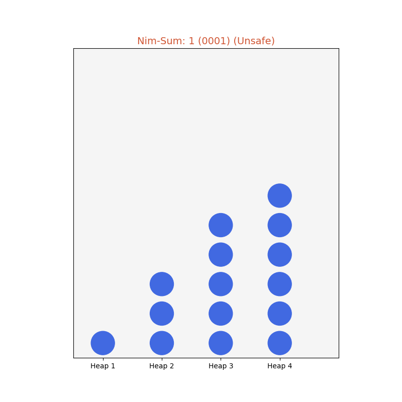
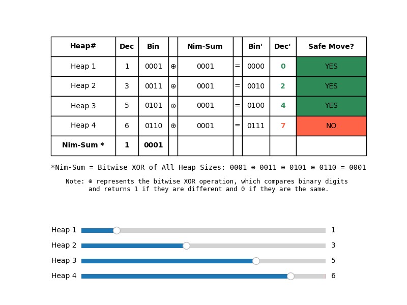

# The Secret of NIM

The Game of Nim is a mathematical strategy game where two players take turns removing objects from heaps or piles. The goal is to be the player who takes the last object. Although it may appear complex at first, Nim has a simple yet beautiful winning strategy based on binary arithmetic and the concept of the "Nim-sum."

## Historical Context

The game of Nim has ancient roots, but its mathematical foundations were laid in 1901 by Charles L. Bouton, who developed a complete mathematical theory of Nim based on binary addition modulo 2 — an operation equivalent to the bitwise XOR of heap sizes, now commonly called the Nim-sum. Nim became a cornerstone of combinatorial game theory and even inspired early computer implementations, such as the 1951 Nimrod computer. Today, it remains a classic example of strategic thinking and binary arithmetic.

## How to Play

1. **Setup:** The game starts with several heaps, each containing a specific number of objects (e.g., sticks, stones, coins). You can adjust the number of objects in each heap using the sliders in our interactive visualization. The default setup includes four heaps.

2. **Turns:** Players alternate turns. On each turn, a player **must** select a heap and remove at least one object from it. A player can remove any number of objects from the chosen heap, up to the entire heap.

3. **Winning:** The player who takes the last object wins the game.

---

## Understanding the Nim-Sum: Binary XOR (⊕ - Circle Plus Symbol)

The key to winning Nim lies in understanding the **Nim-sum**, calculated using the **bitwise XOR operation** (`^` or "XOR").

1. **Binary Representation:** Convert the number of objects in each heap to binary. For example, 5 in decimal is `101` in binary. The code uses a 4-bit binary representation, so 5 becomes `0101`.

2. **Bitwise XOR:** The XOR operation compares the bits in the binary representations of heap sizes. If the bits are the same (0 and 0 or 1 and 1), the result is 0. If the bits are different (0 and 1 or 1 and 0), the result is 1. We perform this operation on the binary representations of *all* heap sizes.

---

## Calculating the Nim-sum: An Example

Let’s consider heaps with sizes 1, 3, 5, and 7:

    1 (decimal)  = 0001 (binary)
    3 (decimal)  = 0011 (binary)
    5 (decimal)  = 0101 (binary)
    7 (decimal)  = 0111 (binary)

The Nim-sum is the result of XORing all heap sizes:

    Nim-sum = 0001 XOR 0011 XOR 0101 XOR 0111 = 0000 (binary) = 0 (decimal)

By comparing each bit, we get:

- **Rightmost bit:** 1 XOR 1 XOR 1 XOR 1 = 0
- **Second bit from right:** 0 XOR 1 XOR 0 XOR 1 = 0
- **Third bit from right:** 0 XOR 0 XOR 1 XOR 1 = 0
- **Leftmost bit:** 0 XOR 0 XOR 0 XOR 0 = 0

Thus, the Nim-sum is `0000` (0 in decimal).

---

## Winning Strategy for Nim

## Key Concepts

### **Unsafe Game States (Nim-sum ≠ 0)**  

A position where the **Nim-sum is not zero** is called an **unsafe game state**.  
If it is your turn and you **play optimally**, you can always make a move that forces your opponent into a losing position.  

### **Safe Game States (Nim-sum = 0)**  

A position where the **Nim-sum is zero** is called a **safe game state**.  
If you are in a safe game state, **any move you make will leave the Nim-sum nonzero**, giving your opponent a chance to win if they play optimally.  

---

### **How to Win**

#### **Step 1: Calculate the Nim-sum**

Before making your move, compute the **Nim-sum** of all heap sizes.  
The **Nim-sum** is the **bitwise XOR** of all heap values:

$$
\large
\text{Nim-sum} = h_1 \oplus h_2 \oplus \dots \oplus h_n
\large
$$

#### **Step 2: Determine Your Position**

- **If the Nim-sum is 0** → You are in a **safe game state** (which means a losing position if your opponent plays optimally).  
  Any move you make will give your opponent a winning strategy.  

- **If the Nim-sum is not 0** → You are in an **unsafe game state** (which means a winning position if you play optimally).  
  You should move to a **safe game state** by following Step 3.

#### **Step 3: Move to a Safe Game State**

Find a heap $$\large h_i \large$$ where reducing it to:

$$
\large
h_i' = h_i \oplus \text{Nim-sum} \text{ with }  h_i' < h_i
\large
$$

guarantees that the **new Nim-sum becomes 0**, putting your opponent in a losing position.

---

### **Why This Works**

By ensuring the new Nim-sum is zero, you force your opponent into a position where they **cannot** make a move that results in a Nim-sum of zero again.

## Beyond Nim: How Grundy Numbers (Nimbers) Solve Impartial Games

While Nim itself is a classic and elegant game, the concept of Grundy numbers (also known as nimbers) extends far beyond it. These numbers provide a universal way to analyze and solve a wide range of impartial games—games where the available moves depend only on the state of the game, not on whose turn it is. By translating complex game positions into equivalent Nim heaps using Grundy numbers, we unlock a powerful and general winning strategy.

The winning strategy in Nim is based on these Grundy numbers. In Nim, the Grundy number for a heap is simply its size. In other impartial games, a position's Grundy number is found by taking the Mex (Minimum Excluded value) of the set of Grundy numbers of all possible next moves. This means it's the smallest non-negative integer not present in that set. This method allows us to reduce complex impartial games to Nim and apply the same winning strategy.
See Sprague–Grundy theorem <https://en.wikipedia.org/wiki/Sprague–Grundy_theorem>
